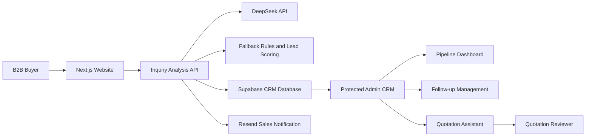
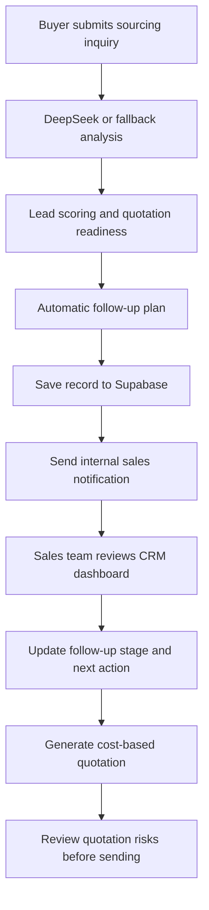
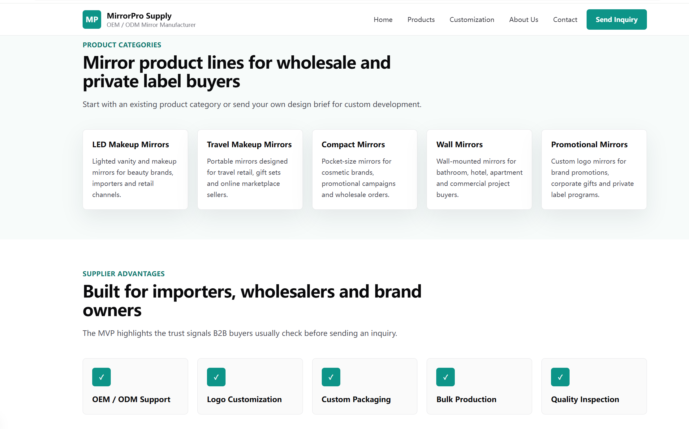
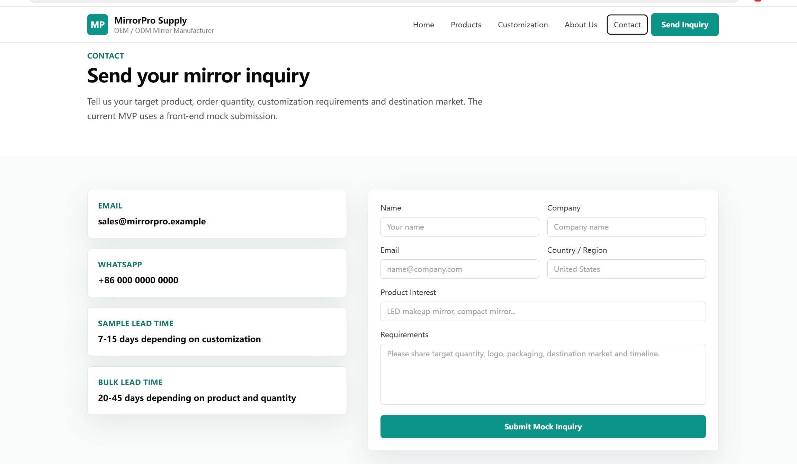
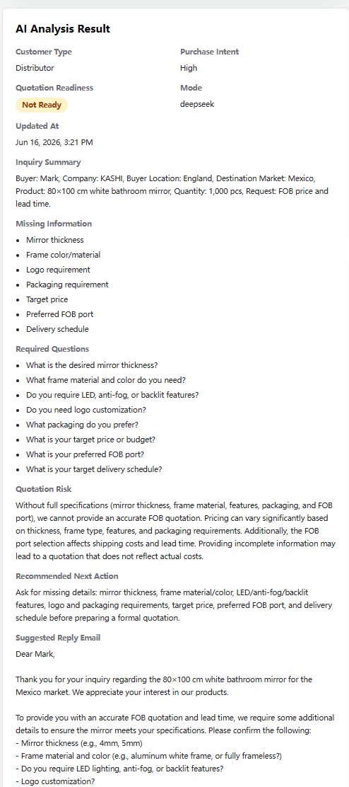

# AI Foreign Trade Sales CRM

An AI-powered B2B foreign trade sales CRM that helps sales teams analyze website inquiries, score leads, generate follow-up plans, manage quotations, and monitor sales pipeline metrics.

## Project Links

- [Online Demo](https://ai-foreign-trade-sales-crm.vercel.app)
- [GitHub Repository](https://github.com/0711-creater/ai-foreign-trade-sales-crm)
- Admin Dashboard: `/admin/dashboard`

The Admin Dashboard is protected by Basic Auth. Demo credentials are not published in this repository or its documentation.

## Project Overview

AI Foreign Trade Sales CRM combines a customer-facing B2B product website with an internal AI-assisted sales workspace. Buyers can submit sourcing requirements from the website, while sales teams receive structured inquiry analysis, lead priority, quotation-readiness checks, follow-up tasks, quotation drafts, risk reviews, and pipeline visibility.

The current demo uses mirror products, but the workflow can be adapted to export categories such as beauty accessories, gifts, home products, hardware, and private-label consumer goods.

## Problem It Solves

Foreign trade inquiries often arrive with incomplete specifications, unclear purchase intent, and different levels of commercial value. Sales teams must manually determine:

- Which leads deserve immediate attention
- What information is missing before quotation
- When and how to follow up
- Whether a quotation email contains commercial risks
- How the overall sales pipeline is progressing

This project turns that fragmented process into a structured workflow from website inquiry to CRM follow-up and quotation review.

## Key Features

- **B2B Independent Website**: Product listing, product detail, customization, company, and contact pages
- **AI Inquiry Analysis**: DeepSeek identifies buyer type, purchase intent, requirements, and suggested responses
- **Lead Scoring**: Scores leads from 0-100 and classifies High, Medium, or Low priority
- **Follow-up Task Planning**: Generates due time, priority, stage, and recommended next action
- **Quotation Readiness Checker**: Detects missing specifications and generates buyer questions
- **CRM Dashboard**: Displays pipeline KPIs, lead distributions, high-value leads, and overdue tasks
- **Supabase Persistent Storage**: Stores inquiries, AI analysis, follow-up state, and quotation history
- **Resend Email Notification**: Sends internal sales alerts with CRM detail links
- **Admin Basic Auth Protection**: Protects admin pages and inquiry APIs
- **Quotation Assistant**: Calculates cost-based unit price, margin, and total amount
- **Quotation Reviewer**: Detects risky wording, missing terms, and quotation inconsistencies
- **AI Email Reply Agent**: Classifies customer emails and generates human-reviewed reply drafts
- **Resilient Fallbacks**: Keeps inquiry analysis and notifications usable when external providers are unavailable

## Tech Stack

| Layer | Technology |
| --- | --- |
| Frontend | Next.js, React, TypeScript, Tailwind CSS |
| Backend | Next.js App Router API Routes, Node.js runtime |
| AI | DeepSeek API with deterministic fallback analysis |
| Database | Supabase PostgreSQL |
| Email | Resend |
| Authentication | HTTP Basic Auth through Next.js middleware |
| Deployment | Vercel |
| Source Control | GitHub |

## System Architecture



Key project directories:

```text
src/app                 Website, admin pages, and App Router routes
src/app/api             Inquiry, CRM, and quotation APIs
src/components          Reusable website and analysis UI
src/data                Static product catalog
src/lib                 AI rules, storage, metrics, quotation, and email logic
screenshots             Portfolio screenshots
storage                 Development fallback data directory
```

## Core User Flow



## Screenshots

### Homepage



### Contact Form



### AI Analysis Result



### CRM Inquiries List


### Inquiry Detail Page


### Quotation Assistant


### Follow-up Management


### CRM Dashboard


Additional screenshots:

- [Product listing](screenshots/products-page.png)
- [Product detail](screenshots/product-detail-page.png)
- [Quotation reviewer](screenshots/quotation-reviewer.png)

## Environment Variables

Create `.env.local` and provide the required server credentials. Do not commit this file.

```bash
DEEPSEEK_API_KEY=
DEEPSEEK_BASE_URL=
DEEPSEEK_MODEL=

NEXT_PUBLIC_SUPABASE_URL=
SUPABASE_SERVICE_ROLE_KEY=

RESEND_API_KEY=
EMAIL_NOTIFICATION_ENABLED=
SALES_NOTIFICATION_EMAIL=
FROM_EMAIL=
APP_BASE_URL=

ADMIN_USERNAME=
ADMIN_PASSWORD=
```

Recommended defaults:

```bash
DEEPSEEK_BASE_URL=https://api.deepseek.com
DEEPSEEK_MODEL=deepseek-v4-flash
EMAIL_NOTIFICATION_ENABLED=false
APP_BASE_URL=http://localhost:3000
```

## Local Development

```bash
npm install
npm run dev
```

Open:

```text
Website:       http://localhost:3000
Contact:       http://localhost:3000/contact
CRM records:   http://localhost:3000/admin/inquiries
CRM dashboard: http://localhost:3000/admin/dashboard
Email agent:   http://localhost:3000/admin/email-agent
```

Quality checks:

```bash
npm run lint
npm run build
```

## Deployment

The project is designed for Vercel deployment.

1. Push the repository to GitHub.
2. Import the repository into Vercel.
3. Configure all required environment variables in Vercel Project Settings.
4. Configure the Supabase `inquiries` table and service-role access.
5. Verify the Resend sender domain before enabling real email notifications.
6. Set `APP_BASE_URL` to the production domain.
7. Redeploy after changing environment variables.

Supabase is the persistent production data source. The file-based development fallback is retained only for local resilience and should not be treated as production storage.

## Security Notes

- Admin routes under `/admin/:path*` are protected by Basic Auth.
- Inquiry management APIs under `/api/inquiries/:path*` are also protected.
- `SUPABASE_SERVICE_ROLE_KEY` is imported only by server-side modules.
- DeepSeek, Supabase, Resend, and admin credentials are managed through environment variables.
- The public contact form calls a server API and never receives secret keys.
- `.env`, `.env.local`, `.env*.local`, and customer inquiry data are excluded from Git.
- Basic Auth is appropriate for this portfolio deployment; production teams should adopt identity-based authentication, session management, role-based access control, and audit logs.

## V2.8 AI Email Reply Agent

- AI Email Reply Agent
- Email intent classification
- Reply draft generation
- WhatsApp follow-up message
- Human-reviewed email workflow
- Email reply draft storage

The protected `/admin/email-agent` workspace accepts a customer email and a sales reply goal, then generates a structured English reply draft through DeepSeek or deterministic fallback logic. The draft includes intent classification, a customer summary, missing information, reply subject, reply body, WhatsApp follow-up, next action and risk notes.

Drafts are saved to the Supabase `email_reply_drafts` table when configured. The module only creates drafts for human review and never sends customer-facing email automatically.

Create the table in Supabase SQL Editor:

```sql
create table if not exists email_reply_drafts (
  id text primary key,
  created_at timestamptz default now(),
  updated_at timestamptz,
  customer_name text,
  customer_email text,
  company text,
  country text,
  product text,
  original_email text,
  reply_goal text,
  email_intent text,
  customer_summary text,
  missing_information jsonb,
  suggested_reply_subject text,
  suggested_reply_email text,
  whatsapp_follow_up_message text,
  next_action text,
  risk_notes text,
  mode text
);

notify pgrst, 'reload schema';
```

## V2.9 Email Reply Draft Detail Page

- Email Reply Draft Detail Page
- Human review workflow
- Editable AI reply draft
- Draft status management
- Internal note support

Each saved draft can be opened at `/admin/email-agent/[id]`. The protected detail page displays the customer context, original email, AI analysis and full reply draft. Sales users can edit the subject, email reply, WhatsApp message and next action, then manage the draft through these statuses:

```text
Draft
Reviewed
Ready to Send
Sent
Archived
```

The workflow only stores and reviews drafts. It does not automatically send customer-facing email.

Upgrade the Supabase table in SQL Editor:

```sql
alter table email_reply_drafts
add column if not exists draft_status text default 'Draft',
add column if not exists reviewed_at timestamptz,
add column if not exists reviewed_by text,
add column if not exists internal_note text;

notify pgrst, 'reload schema';
```

## V3.0 Email Reply Draft Pipeline Dashboard

- Email Reply Draft Pipeline Dashboard
- Draft status analytics
- Ready-to-send draft management
- High-risk draft monitoring
- Human-reviewed email workflow

The protected `/admin/email-agent/dashboard` page summarizes the email reply draft pipeline. It displays total draft counts, status distribution, recent drafts, drafts marked Ready to Send, and drafts that contain risk notes requiring human verification.

The dashboard uses deterministic metrics from stored draft records and does not call AI or send customer-facing email.

## V3.1 Email Reply Draft Manual Send Workflow

- Manual email sending workflow
- Human confirmation before sending
- Ready-to-send validation
- Resend email delivery
- Send status tracking
- Send error logging

The protected draft detail page only displays the Send Email action after the saved draft status is `Ready to Send`. A backend user must click the button and accept a second confirmation before the server sends the reviewed draft through Resend.

The send API re-reads the stored draft and validates the status, recipient, subject and email body. AI never triggers customer-facing email automatically. Successful and failed delivery attempts are recorded on the draft.

Upgrade the Supabase table in SQL Editor:

```sql
alter table email_reply_drafts
add column if not exists sent_at timestamptz,
add column if not exists sent_by text,
add column if not exists send_status text default 'Not Sent',
add column if not exists send_error text,
add column if not exists resend_message_id text;

notify pgrst, 'reload schema';
```

## V3.2 Email Send Audit Log

- Email send audit log
- Send attempt tracking
- Success and failure logging
- Resend provider message ID tracking
- Draft-level send history

Every manual email delivery attempt creates a separate audit record without replacing previous history. The protected `/admin/email-agent/send-logs` page summarizes total attempts, successful sends, failed sends and delivery success rate. Each draft detail page also displays its own send history.

Create the audit table in Supabase SQL Editor:

```sql
create table if not exists email_send_logs (
  id text primary key,
  created_at timestamptz default now(),
  draft_id text,
  customer_email text,
  customer_name text,
  company text,
  product text,
  subject text,
  sent_by text,
  send_status text,
  resend_message_id text,
  error_message text,
  provider text default 'resend'
);

notify pgrst, 'reload schema';
```

## V3.3 AI Email Reply Quality Reviewer

- AI Email Reply Quality Reviewer
- Review score
- Risk detection
- Missing point detection
- Human-in-the-loop quality gate
- Pre-send AI review workflow

The protected email draft detail page can run a quality review before manual sending. DeepSeek evaluates whether the reply addresses the buyer's request, asks for missing specifications, uses professional export-sales English, and avoids unsupported price, delivery, certification, quality, or capacity commitments.

Review scores are normalized into three statuses:

```text
90-100: Pass
70-89: Needs Revision
0-69:  High Risk
```

The reviewer falls back to deterministic local rules when DeepSeek is unavailable. It never sends email or automatically changes a draft to Ready to Send. A human sales user remains responsible for editing, approving, and sending the final reply.

Upgrade the Supabase table in SQL Editor:

```sql
alter table email_reply_drafts
add column if not exists review_score integer,
add column if not exists review_status text default 'Not Reviewed',
add column if not exists review_summary text,
add column if not exists review_risks jsonb,
add column if not exists review_suggestions jsonb,
add column if not exists review_missing_points jsonb,
add column if not exists reviewed_by_ai_at timestamptz,
add column if not exists review_mode text;

notify pgrst, 'reload schema';
```

## Future Improvements

- Supabase Auth or Auth.js admin authentication
- Role-based permissions for sales managers and representatives
- Customer and company relationship records
- Scheduled follow-up reminders and background jobs
- Email reply sending and conversation history
- Quote approval workflow
- Product and price-list management
- CRM search, pagination, export, and reporting
- Automated tests for business rules and API routes
- Observability, audit logs, and error monitoring

## Interview Talking Points

For resume-ready project descriptions, recruitment platform copy, a three-minute demo script, and an extended interview Q&A library, see:

### [Career & Interview Package](docs/career-package.md)

For a focused case study covering the AI email drafting, quality review, manual sending, and audit workflow, see:

### [AI Email Reply Agent Portfolio](docs/email-agent-portfolio.md)

### 1. Why this project was built

It demonstrates how AI can improve a real B2B sales workflow rather than operating as an isolated chatbot. The product connects lead capture, qualification, follow-up, quotation, and management reporting.

### 2. How AI analysis is triggered

The public inquiry form posts to a Next.js server route. The route validates input, requests structured JSON from DeepSeek, validates the result, and uses deterministic fallback analysis when the provider is unavailable.

### 3. How lead scoring works

Lead score combines quantity, customer type, purchase intent, quotation readiness, message quality, and urgency. Priority is derived from fixed thresholds so High, Medium, and Low classifications remain consistent.

### 4. How follow-up tasks are generated

A deterministic planner converts lead priority into a due time, follow-up priority, initial stage, and next action. High-priority leads are scheduled sooner than lower-priority leads.

### 5. How Supabase is used

The server-side storage layer maps application camelCase fields to PostgreSQL snake_case columns. It centralizes create, read, update, quotation-history, and fallback behavior without exposing the service-role key.

### 6. How email notification works

After analysis and persistence, the server builds an internal sales notification containing buyer information, AI analysis, lead score, follow-up plan, and a protected CRM link. Resend handles delivery, with non-blocking fallback behavior.

### 7. How admin security is handled

Next.js middleware applies Basic Auth to admin pages and inquiry management APIs. Public product and contact pages remain accessible, while sensitive credentials stay server-side.

### 8. How this project can be extended for real business use

The current architecture can evolve into a multi-user CRM by adding identity authentication, role-based access, customer entities, scheduled jobs, communication history, approval workflows, analytics, and integration with ERP or shipping systems.
