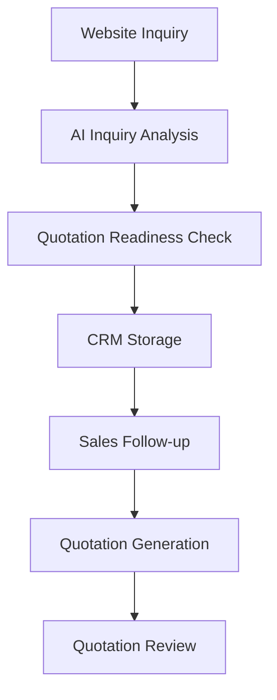

# AI Foreign Trade Sales CRM

A B2B independent website and AI-powered sales CRM for foreign trade inquiry analysis, quotation generation, and quotation review.

## Project Overview

AI Foreign Trade Sales CRM is a portfolio MVP for the foreign trade B2B sales workflow. It combines a product-focused independent website with an AI-assisted CRM so sales teams can collect website inquiries, analyze buyer intent, identify missing quotation information, generate cost-based quotations, and review quotation risks before replying to buyers.

The project uses mirror products as the demo industry, but the workflow can be adapted to other export categories such as gifts, beauty accessories, hardware, home products, and custom promotional products.

## Target Users

- Foreign trade sales teams
- B2B suppliers
- Export companies
- Importers / wholesalers management teams
- Small factories building independent websites

## Core Features

- B2B independent website
- Product listing and product detail pages
- Website inquiry form
- DeepSeek API inquiry analysis
- Mock fallback mode
- Quotation readiness checker
- Missing information detection
- Required questions generation
- Local JSON-based CRM
- Inquiry status management
- Follow-up notes
- AI quotation assistant
- Cost-based quotation calculation
- AI quotation email generation
- AI quotation reviewer
- Risk item detection
- Revised quotation email generation

## Tech Stack

- Next.js
- TypeScript
- Tailwind CSS
- DeepSeek API
- Supabase
- App Router API Routes
- Local JSON storage
- Mock fallback
- Node.js fs/path server utilities

## System Workflow

The system starts from a buyer inquiry on the website, runs AI analysis, checks quotation readiness, saves the lead into a local CRM, and supports sales follow-up, quotation generation, and quotation review.



## Project Architecture

- `src/app`: Next.js App Router pages, including website pages and admin CRM pages.
- `src/app/api`: Server-side API Routes for inquiry analysis, CRM records, status updates, quotation generation, and quotation review.
- `src/components`: Reusable UI components such as the inquiry form, navigation, footer, and product cards.
- `src/lib`: Business logic utilities for AI inquiry analysis, local inquiry storage, quotation calculation, and quotation review.
- `src/data`: Static product data used by the product listing and product detail pages.
- `storage`: Local JSON storage folder for MVP inquiry records. Real customer data should not be committed.
- `screenshots`: Recommended location for portfolio screenshots.

## Environment Variables

Create a local `.env.local` file:

```bash
DEEPSEEK_API_KEY=
DEEPSEEK_BASE_URL=https://api.deepseek.com
DEEPSEEK_MODEL=deepseek-v4-flash
NEXT_PUBLIC_SUPABASE_URL=
SUPABASE_SERVICE_ROLE_KEY=
ADMIN_USERNAME=
ADMIN_PASSWORD=
EMAIL_NOTIFICATION_ENABLED=false
SALES_NOTIFICATION_EMAIL=
FROM_EMAIL=
APP_BASE_URL=
RESEND_API_KEY=
```

Do not commit `.env.local` to GitHub.

When `DEEPSEEK_API_KEY` is missing or the API call fails, the project automatically uses Mock fallback mode.

`SUPABASE_SERVICE_ROLE_KEY` must only be used on the server side. Do not expose it in Client Components and do not create `NEXT_PUBLIC_SUPABASE_SERVICE_ROLE_KEY`.

`ADMIN_USERNAME` and `ADMIN_PASSWORD` protect the CRM dashboard and inquiry API routes with Basic Auth. Do not commit real admin credentials to GitHub.

`EMAIL_NOTIFICATION_ENABLED=false` keeps notification in Mock mode. For real Resend email notification, set `EMAIL_NOTIFICATION_ENABLED=true` and configure `RESEND_API_KEY`, `SALES_NOTIFICATION_EMAIL`, `FROM_EMAIL`, and `APP_BASE_URL`.

## Local Development

Install dependencies:

```bash
npm install
```

Run the development server:

```bash
npm run dev
```

Run lint:

```bash
npm run lint
```

Run production build:

```bash
npm run build
```

Main URLs:

```text
http://localhost:3000
http://localhost:3000/products
http://localhost:3000/contact
http://localhost:3000/admin/inquiries
```

## Screenshots

Current screenshot files:

- `screenshots/home-page.png`
- `screenshots/products-page.png`
- `screenshots/product-detail-page.png`
- `screenshots/contact-form-page.png`

Recommended screenshots for portfolio completion:

- `screenshots/ai-analysis-result-v1.3.png`
- `screenshots/admin-inquiries-page.png`
- `screenshots/inquiry-detail-page.png`
- `screenshots/quotation-assistant.png`
- `screenshots/quotation-reviewer.png`

## MVP Limitations

- Local JSON storage is for MVP only.
- No real admin authentication yet.
- Not suitable for production deployment as-is.
- Use PostgreSQL / Supabase / MySQL / MongoDB for production.
- Add admin authentication before deployment.

## Vercel Deployment Notes

- Vercel deployment can display the website and AI analysis.
- For Vercel production deployment, configure `NEXT_PUBLIC_SUPABASE_URL`, `SUPABASE_SERVICE_ROLE_KEY`, `ADMIN_USERNAME` and `ADMIN_PASSWORD`.
- Local JSON storage is not suitable for production or persistent storage on Vercel.
- Serverless functions should not be used as a reliable file-based CRM database.
- If Supabase is not configured, the `/admin/inquiries` page can still open with an empty state or local JSON fallback warning.
- For production CRM data persistence, use Supabase / PostgreSQL / MySQL / MongoDB.

## V2.0 Supabase Database Integration

- Supabase database integration
- Persistent inquiry storage
- Production-ready CRM data source
- Local JSON fallback retained for development

The CRM storage layer now uses Supabase first when the following environment variables are configured:

```bash
NEXT_PUBLIC_SUPABASE_URL=
SUPABASE_SERVICE_ROLE_KEY=
```

When Supabase is unavailable or not configured, the project falls back to local JSON storage for local development only. On Vercel, use Supabase as the persistent CRM data source.

## V2.1 Admin Access Protection

- Admin access protection
- Basic Auth for CRM dashboard
- Protected inquiry API routes
- Public contact form remains available

Protected paths:

```text
/admin
/admin/:path*
/api/inquiries
/api/inquiries/:path*
```

Public paths remain available:

```text
/
/products
/contact
/api/analyze-inquiry
```

For Vercel production deployment, add these variables in Vercel Settings -> Environment Variables:

```bash
ADMIN_USERNAME=your_admin_username
ADMIN_PASSWORD=your_admin_password
```

Do not store real admin credentials in the repository. The public website and contact inquiry form remain accessible without Basic Auth.

## V2.2 Inquiry Email Notification

- Inquiry email notification
- Internal sales alert
- CRM detail link in notification
- Mock notification mode
- Email service extension-ready design

After a website inquiry is analyzed and saved, the server generates an internal sales notification payload. By default, the current version uses Mock notification mode and logs the notification summary on the server.

Current version supports mock notification by default. Real email provider integration is available through Resend, while the notification module still keeps Mock fallback when email sending is disabled or fails.

Notification environment variables:

```bash
EMAIL_NOTIFICATION_ENABLED=false
SALES_NOTIFICATION_EMAIL=
FROM_EMAIL=
APP_BASE_URL=
RESEND_API_KEY=
```

Email notification failure must not block the website inquiry submission flow.

## V2.3 Real Email Notification with Resend

- Resend email notification
- Real internal sales alert
- CRM detail link in email
- Mock fallback retained

For real email notification, configure these environment variables on the server side:

```bash
RESEND_API_KEY=
EMAIL_NOTIFICATION_ENABLED=true
SALES_NOTIFICATION_EMAIL=
FROM_EMAIL=
APP_BASE_URL=
```

`RESEND_API_KEY` must not be exposed in Client Components or committed to GitHub. If Resend is not configured, disabled, or fails to send, the inquiry submission, AI analysis, Supabase saving, and frontend result display continue normally with Mock fallback.

## V2.4 AI Lead Scoring & Priority System

- AI Lead Scoring
- Lead Priority Classification
- Sales follow-up timing recommendation
- Lead scoring reason
- CRM lead prioritization

After each inquiry is analyzed, the system assigns a lead score from 0 to 100 based on quantity, purchase intent, customer type, quotation readiness, message quality and urgency. CRM records can then be sorted by lead priority so sales teams can follow up high-value buyers first.

For Supabase storage, add these columns in Supabase SQL Editor:

```sql
alter table inquiries
add column if not exists lead_score integer,
add column if not exists lead_priority text,
add column if not exists lead_score_reason text,
add column if not exists recommended_follow_up_time text,
add column if not exists sales_strategy text;

notify pgrst, 'reload schema';
```

## V2.5 AI Follow-up Task System

- AI Follow-up Task System
- Follow-up due time generation
- Follow-up priority
- CRM follow-up stage management
- Overdue lead detection
- Sales next-action recommendation

After lead scoring is complete, the server creates a deterministic follow-up plan. High-priority leads are scheduled within two hours, medium-priority leads within 24 hours, and low-priority leads within three days. The CRM supports follow-up filters, overdue detection, stage updates, last-contacted timestamps and editable next actions.

Follow-up stages:

```text
New
First Contact
Quotation Sent
Waiting Reply
Negotiation
Closed
Lost
```

The Supabase `inquiries` table uses these follow-up columns:

```text
follow_up_due_at
follow_up_stage
last_contacted_at
next_action
follow_up_priority
```

## V2.6 CRM Pipeline Dashboard

- CRM Pipeline Dashboard
- Sales KPI overview
- Lead priority distribution
- Follow-up overdue detection
- Recent high-value leads
- Sales management dashboard

The protected `/admin/dashboard` page reads CRM records through the server-side storage layer and summarizes the sales pipeline without exposing Supabase credentials to the browser.

Dashboard coverage:

- Total inquiries, new leads and high-priority leads
- Overdue follow-ups
- Quotation ready and not-ready counts
- Average lead score
- Lead priority, follow-up stage and purchase intent distributions
- Recent high-value lead table
- Overdue follow-up table

## Future Roadmap

- Supabase / PostgreSQL database
- Admin login authentication
- Email notification
- Customer background research agent
- AI follow-up reminder
- Quote approval workflow
- Deployment to Vercel

## Interview Talking Points

What this project demonstrates:

- AI application engineering
- API integration
- Prompt engineering
- B2B workflow automation
- CRM workflow design
- Cost-based quotation logic
- AI output risk control
- Full-stack project delivery

## Portfolio Notes

This project is designed as a GitHub portfolio project for AI application development and frontend/full-stack engineering. It demonstrates how a standard B2B independent website can evolve into an AI-assisted sales workflow covering lead capture, buyer analysis, quotation preparation, and quotation risk control.
