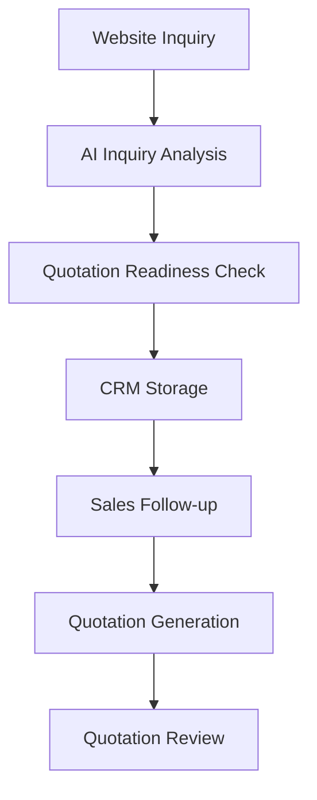

# AI Foreign Trade Sales CRM

A B2B independent website and AI-powered sales CRM for foreign trade inquiry analysis, quotation generation, and quotation review.

## Project Overview

AI Foreign Trade Sales CRM is a portfolio MVP for the foreign trade B2B sales workflow. It combines a product-focused independent website with an AI-assisted CRM so sales teams can collect website inquiries, analyze buyer intent, identify missing quotation information, generate cost-based quotations, and review quotation risks before replying to buyers.

The project uses mirror products as the demo industry, but the workflow can be adapted to other export categories such as gifts, beauty accessories, hardware, home products, and custom promotional products.

## Target Users

- Foreign trade sales teams
- B2B suppliers
- Export companies
- Importers / wholesalers management teams
- Small factories building independent websites

## Core Features

- B2B independent website
- Product listing and product detail pages
- Website inquiry form
- DeepSeek API inquiry analysis
- Mock fallback mode
- Quotation readiness checker
- Missing information detection
- Required questions generation
- Local JSON-based CRM
- Inquiry status management
- Follow-up notes
- AI quotation assistant
- Cost-based quotation calculation
- AI quotation email generation
- AI quotation reviewer
- Risk item detection
- Revised quotation email generation

## Tech Stack

- Next.js
- TypeScript
- Tailwind CSS
- DeepSeek API
- App Router API Routes
- Local JSON storage
- Mock fallback
- Node.js fs/path server utilities

## System Workflow

The system starts from a buyer inquiry on the website, runs AI analysis, checks quotation readiness, saves the lead into a local CRM, and supports sales follow-up, quotation generation, and quotation review.



## Project Architecture

- `src/app`: Next.js App Router pages, including website pages and admin CRM pages.
- `src/app/api`: Server-side API Routes for inquiry analysis, CRM records, status updates, quotation generation, and quotation review.
- `src/components`: Reusable UI components such as the inquiry form, navigation, footer, and product cards.
- `src/lib`: Business logic utilities for AI inquiry analysis, local inquiry storage, quotation calculation, and quotation review.
- `src/data`: Static product data used by the product listing and product detail pages.
- `storage`: Local JSON storage folder for MVP inquiry records. Real customer data should not be committed.
- `screenshots`: Recommended location for portfolio screenshots.

## Environment Variables

Create a local `.env.local` file:

```bash
DEEPSEEK_API_KEY=
DEEPSEEK_BASE_URL=https://api.deepseek.com
DEEPSEEK_MODEL=deepseek-v4-flash
```

Do not commit `.env.local` to GitHub.

When `DEEPSEEK_API_KEY` is missing or the API call fails, the project automatically uses Mock fallback mode.

## Local Development

Install dependencies:

```bash
npm install
```

Run the development server:

```bash
npm run dev
```

Run lint:

```bash
npm run lint
```

Run production build:

```bash
npm run build
```

Main URLs:

```text
http://localhost:3000
http://localhost:3000/products
http://localhost:3000/contact
http://localhost:3000/admin/inquiries
```

## Screenshots

Current screenshot files:

- `screenshots/home-page.png`
- `screenshots/products-page.png`
- `screenshots/product-detail-page.png`
- `screenshots/contact-form-page.png`

Recommended screenshots for portfolio completion:

- `screenshots/ai-analysis-result-v1.3.png`
- `screenshots/admin-inquiries-page.png`
- `screenshots/inquiry-detail-page.png`
- `screenshots/quotation-assistant.png`
- `screenshots/quotation-reviewer.png`

## MVP Limitations

- Local JSON storage is for MVP only.
- No real admin authentication yet.
- Not suitable for production deployment as-is.
- Use PostgreSQL / Supabase / MySQL / MongoDB for production.
- Add admin authentication before deployment.

## Vercel Deployment Notes

- Vercel deployment can display the website and AI analysis.
- Local JSON storage is not suitable for production or persistent storage on Vercel.
- Serverless functions should not be used as a reliable file-based CRM database.
- The `/admin/inquiries` page can still open with an empty state if local JSON storage is unavailable.
- For production CRM data persistence, use Supabase / PostgreSQL / MySQL / MongoDB.

## Future Roadmap

- Supabase / PostgreSQL database
- Admin login authentication
- Email notification
- Customer background research agent
- AI follow-up reminder
- Quote approval workflow
- Deployment to Vercel

## Interview Talking Points

What this project demonstrates:

- AI application engineering
- API integration
- Prompt engineering
- B2B workflow automation
- CRM workflow design
- Cost-based quotation logic
- AI output risk control
- Full-stack project delivery

## Portfolio Notes

This project is designed as a GitHub portfolio project for AI application development and frontend/full-stack engineering. It demonstrates how a standard B2B independent website can evolve into an AI-assisted sales workflow covering lead capture, buyer analysis, quotation preparation, and quotation risk control.
