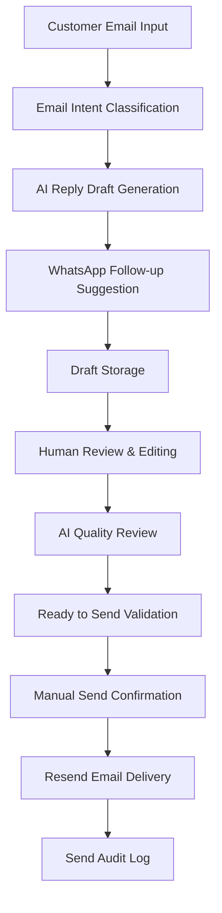
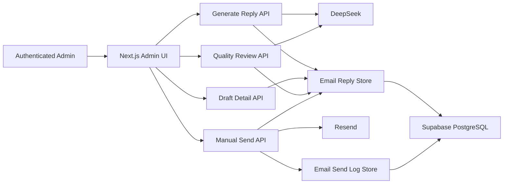

# AI Email Reply Agent

## Project Links

- [Online Demo](https://ai-foreign-trade-sales-crm.vercel.app)
- [GitHub Repository](https://github.com/0711-creater/ai-foreign-trade-sales-crm)
- Email Agent: `/admin/email-agent`
- Draft Dashboard: `/admin/email-agent/dashboard`
- Send Audit Logs: `/admin/email-agent/send-logs`

Admin pages are protected by Basic Auth. Demo credentials are not published in the repository or documentation.

## Project Overview

AI Email Reply Agent 是一个面向 B2B 外贸业务员的 AI 邮件回复工作台。业务员输入客户邮件和本次回复目标后，系统能够识别邮件意图、提取缺失信息、生成专业英文回复草稿和 WhatsApp 跟进话术，并将草稿保存到 Supabase。

生成结果不会被 AI 自动发送。业务员需要进入草稿详情页进行人工编辑，运行 AI Quality Review 检查专业度、完整性和商业风险，再决定是否将草稿标记为 `Ready to Send`。只有符合状态要求的草稿才能通过人工二次确认调用 Resend 发送，所有成功和失败的发送尝试都会写入审计日志。

这个模块展示的重点不是单次文本生成，而是一个包含生成、审核、状态控制、人工确认、发送和审计的完整 Human-in-the-loop 工作流。

## Problem It Solves

外贸邮件回复并不是简单的英文润色，实际工作中存在以下问题：

1. **客户邮件信息不完整**：客户可能只询问价格，但没有提供数量、尺寸、材质、Logo、包装、贸易条款或交期。
2. **业务员回复效率低**：重复整理客户需求、组织英文表达和编写跟进话术会消耗大量时间。
3. **英文回复质量不稳定**：不同业务员的语言能力和行业经验不同，邮件专业度、完整度和语气可能不一致。
4. **报价前容易遗漏关键规格**：如果没有先确认规格和商业条件，直接回复价格容易造成报价不准确。
5. **AI 自动发送存在风险**：模型可能产生过度承诺、误导性表达或未经确认的价格与交期。
6. **发送后缺少审计记录**：仅在草稿上保存最终状态，无法完整追踪每次成功或失败的发送尝试。

AI Email Reply Agent 通过“AI 起草 + AI 审核 + 人工决策 + 系统校验 + 审计记录”的方式处理这些问题。

## Core Workflow



流程说明：

1. 业务员输入客户、公司、国家、产品、原始邮件和 Reply Goal。
2. 服务端调用 DeepSeek，要求返回结构化 JSON。
3. 系统识别 Email Intent，并生成客户摘要、缺失信息、邮件主题、回复正文、WhatsApp 话术和下一步建议。
4. 草稿保存到 Supabase `email_reply_drafts`。
5. 业务员进入详情页修改内容、添加内部备注并管理 Draft Status。
6. 业务员手动运行 AI Quality Review，获得评分、风险、遗漏点和修改建议。
7. 人工确认内容适合发送后，将状态设置为 `Ready to Send`。
8. 系统再次校验状态、收件人、主题和正文，并要求浏览器二次确认。
9. 服务端使用 Resend 发送邮件。
10. 发送结果更新到草稿，同时追加到 `email_send_logs`。

## Key Features

### 1. Email Intent Classification

将客户邮件分类为：

- New Inquiry
- Price Request
- Sample Request
- Customization Request
- Follow-up
- Negotiation
- Complaint
- Other

分类结果帮助业务员快速判断客户邮件的业务目的，并为回复策略提供上下文。

### 2. AI Reply Draft Generation

根据客户邮件、产品和 Reply Goal 生成可人工修改的英文邮件标题和正文。Prompt 明确禁止模型虚构价格、MOQ、认证、产能和交期承诺。

### 3. Missing Information Extraction

识别报价或推进订单前缺失的信息，例如：

- Order quantity
- Final size
- Material or specification
- Logo requirement
- Packaging requirement
- Trade term
- Delivery schedule

### 4. WhatsApp Follow-up Message

生成一到两句话的简短 WhatsApp 跟进话术，便于业务员在邮件之外进行即时沟通。

### 5. Draft Detail Page

详情页集中展示客户信息、原始邮件、AI 分析、回复草稿、内部备注、审核结果、发送状态和发送日志。

### 6. Human Review Workflow

AI 只生成草稿和建议。业务员可以修改邮件内容、检查业务事实、补充条款并决定是否进入发送阶段。

### 7. Draft Status Management

草稿支持以下状态：

```text
Draft
Reviewed
Ready to Send
Sent
Archived
```

状态用于表达草稿所处的人工审核阶段，而不是由 AI 自动推进。

### 8. Manual Send Workflow

发送按钮只在已保存状态为 `Ready to Send` 且尚未发送时出现。业务员点击后还需要确认：

```text
This will send the reviewed email draft to the customer.
```

### 9. Resend Email Delivery

服务端读取 `RESEND_API_KEY` 和 `FROM_EMAIL`，使用草稿中的客户邮箱、主题和正文调用 Resend。密钥不会进入 Client Component。

### 10. Email Send Audit Logs

每一次实际发送尝试都会创建独立日志，不覆盖历史记录。日志包含发送人、状态、Provider、Resend Message ID 和错误信息。

### 11. AI Email Quality Reviewer

DeepSeek 或本地 fallback 会从以下维度审核草稿：

- 是否回应客户问题
- 是否遗漏关键规格
- 是否过度承诺价格、交期、认证或质量
- 英文是否专业自然
- 是否符合外贸邮件语气
- 是否存在误导性表达
- 是否要求客户补充缺失信息
- 是否适合正式发送

### 12. Review Score / Review Status

```text
90-100  Pass
70-89   Needs Revision
0-69    High Risk
```

服务端根据最终分数归一化 Review Status，避免模型返回的状态和评分区间不一致。

### 13. High Risk Detection

系统检查 `best price`、`lowest price`、`top quality`、`perfect product`、`any quantity` 和未经确认的交期承诺等高风险表达。High Risk 草稿会显示红色提示，但仍保留人工修改和测试空间。

### 14. Dashboard KPI

Email Draft Dashboard 展示：

- Total Drafts
- Draft / Reviewed / Ready to Send / Sent / Archived
- High Risk Drafts
- Failed Sends / Not Sent Drafts
- Reviewed Drafts
- Needs Revision
- High Risk Reviews
- Average Review Score

## Technical Architecture

| Layer | Technology | Responsibility |
| --- | --- | --- |
| Application | Next.js App Router | Admin pages, Server Components, API Route orchestration |
| Language | TypeScript | Typed request, draft, review, send, and storage contracts |
| UI | Tailwind CSS | Responsive admin forms, tables, badges, and risk states |
| AI | DeepSeek API | Intent classification, draft generation, and quality review |
| Database | Supabase PostgreSQL | Persistent draft, review, status, and audit data |
| Email Provider | Resend | Manual customer email delivery |
| Deployment | Vercel | Next.js application and server route deployment |
| Access Control | Basic Auth Middleware | Protection for admin pages and email-agent APIs |



## Data Model

### 1. `email_reply_drafts`

该表保存 AI 生成的邮件草稿及其完整生命周期：

- 客户、公司、国家、产品和原始邮件
- Reply Goal、Email Intent 和 Customer Summary
- Missing Information、Risk Notes 和 Next Action
- Suggested Reply Subject / Email / WhatsApp Message
- Draft Status、Reviewed At、Reviewed By 和 Internal Note
- AI Review Score、Status、Summary、Risks、Suggestions 和 Missing Points
- Send Status、Sent At、Sent By、Send Error 和 Resend Message ID

主要用途：

1. 保存 AI 生成的邮件草稿。
2. 保存人工审核和状态管理结果。
3. 保存 AI Quality Review 结果。
4. 保存当前发送状态和 Provider 返回信息。

### 2. `email_send_logs`

该表保存每一次发送尝试：

- Draft ID
- Customer Email / Name
- Company / Product
- Subject
- Sent By
- Send Status
- Resend Message ID
- Error Message
- Provider
- Created At

主要用途：

1. 同时记录成功与失败发送。
2. 保留多次尝试历史，而不是只保留草稿当前状态。
3. 通过 Resend Message ID 辅助排查 Provider 侧投递问题。
4. 通过 Error Message 定位配置、收件人或发送服务错误。

## API Routes

### 1. `POST /api/email-agent/generate-reply`

- 校验 Email Agent 表单
- 调用 DeepSeek 生成结构化回复
- DeepSeek 失败时使用本地 fallback
- 创建 Draft ID 和默认状态
- 保存到 `email_reply_drafts`
- 返回草稿和存储状态

### 2. `GET /api/email-agent/drafts/[id]`

- 根据 ID 获取单条邮件草稿
- 返回客户信息、AI 输出、人工审核、AI Review 和发送状态
- 草稿不存在时返回 404

### 3. `PATCH /api/email-agent/drafts/[id]`

- 更新邮件主题和正文
- 更新 WhatsApp 话术和 Next Action
- 更新 Draft Status 和 Internal Note
- 写入 Reviewed At、Reviewed By 和 Updated At
- 仅接受白名单字段

### 4. `POST /api/email-agent/drafts/[id]/review`

- 读取已保存草稿
- 调用 `reviewEmailReplyDraft()`
- DeepSeek 失败时使用确定性 Mock reviewer
- 保存 Review Score、Status、Summary、Risks、Suggestions 和 Missing Points
- 不执行发送，也不自动改变 Draft Status

### 5. `POST /api/email-agent/drafts/[id]/send`

- 校验人工确认参数
- 重新读取最新草稿
- 校验 Draft Status 必须为 `Ready to Send`
- 校验客户邮箱、邮件主题和正文
- 调用 Resend
- 更新草稿发送状态
- 无论成功或失败，都记录发送审计日志

## Security Design

1. **Admin pages are protected by Basic Auth.** `/admin/email-agent`、详情页、Dashboard 和 Send Logs 均位于受保护的 Admin 路径下。
2. **DeepSeek API Key is only used server-side.** 浏览器只调用项目自己的 API Route。
3. **Resend API Key is only used server-side.** Client Component 不导入发送服务，也无法读取 Key。
4. **Emails are not sent automatically by AI.** AI 只生成和审核草稿。
5. **Only Ready to Send drafts can be sent.** 服务端会重新校验数据库中的真实状态。
6. **Manual confirmation is required before sending.** 用户必须在后台点击按钮并完成二次确认。
7. **Send attempts are logged for auditability.** 成功和失败均保留独立审计记录。

Basic Auth 适合作品集和小型内部演示。正式多用户系统应升级为身份认证、Session、RBAC、数据库 RLS 和更细粒度的操作审计。

## Human-in-the-loop Design

### AI 负责

- 理解客户邮件和业务语境
- 判断 Email Intent
- 生成英文回复草稿
- 提取缺失信息
- 生成 WhatsApp 跟进话术
- 审核回复质量
- 识别遗漏、过度承诺和高风险措辞

### 人负责

- 核对客户信息和产品事实
- 修改邮件标题、正文和跟进话术
- 判断价格、交期、认证等内容是否真实可承诺
- 判断草稿是否可以发送
- 将草稿标记为 `Ready to Send`
- 手动点击并确认发送

### 系统负责

- 保存草稿和编辑结果
- 保存审核结果和状态
- 校验发送前置条件
- 调用 Resend 执行发送
- 更新发送状态
- 记录成功和失败日志

这个职责划分避免把高风险业务决策完全交给生成式 AI，同时保留 AI 对理解、起草和风险提示的效率价值。

## Failure Handling

### 1. DeepSeek API 失败

如果未配置 API Key、请求失败、模型不可用或返回内容不是合法 JSON，系统使用本地 fallback：

- 规则识别 Email Intent
- 规则提取 Missing Information
- 模板生成基础邮件
- 确定性规则执行 Quality Review

### 2. Resend 发送失败

发送 API 不会把失败伪装成成功，而是更新：

```text
send_status = Failed
send_error = provider error message
```

### 3. 失败审计

`email_send_logs` 会新增一条失败记录，包括：

- Draft ID
- Send Status = Failed
- Error Message
- Sent By
- Provider
- Created At

### 4. 前端反馈

草稿详情页显示发送错误，Send Audit Logs 同步展示失败记录，业务员可以修正配置或内容后再次处理。

### 5. 审计日志存储失败

审计日志存储与邮件发送结果解耦。日志写入失败会返回 warning，但不会把已经成功发送的邮件标记为发送失败。

## Demo Script

### 0:00-0:20 打开 Email Agent 页面

“这是 AI Email Reply Agent，路径是 `/admin/email-agent`。它不是自动发信机器人，而是面向外贸业务员的邮件草稿、审核和人工发送工作台。后台使用 Basic Auth 保护。”

### 0:20-0:40 输入客户邮件

“我输入客户姓名、邮箱、公司、国家、产品和一封询价邮件，再选择 Reply Goal，例如 Send quotation preparation reply。”

示例邮件：

```text
We need 1,000 wall mirrors for the UK market.
Please send your best price and confirm fast delivery.
We may need our logo and custom packaging.
```

### 0:40-1:00 生成 AI Reply Draft

“点击 Generate Reply 后，前端调用 Next.js API Route。DeepSeek 返回结构化 JSON；如果调用失败，系统会使用本地 fallback，不会让页面完全不可用。”

### 1:00-1:20 查看 Intent 和 Missing Information

“结果区会显示 Email Intent，例如 Price Request，并提取缺失的最终尺寸、材质、贸易条款或交期。系统同时生成英文邮件、WhatsApp 话术和下一步建议。”

### 1:20-1:40 进入 Draft Detail Page

“生成结果会保存到 Supabase。进入详情页后，可以看到原始邮件、AI 分析和完整草稿，也可以编辑主题、正文、WhatsApp 消息和内部备注。”

### 1:40-2:00 运行 AI Quality Review

“点击 Run AI Review，系统会先保存当前编辑版本，再审核是否完整回应客户、是否遗漏规格、是否存在 best price 或未经确认的交期承诺。结果包含 Review Score、Status、Risks、Suggestions 和 Missing Points。”

### 2:00-2:15 修改邮件草稿

“如果状态是 Needs Revision 或 High Risk，页面会给出醒目提示。我根据建议将 best price 改为 accurate quotation，并增加对尺寸、材质、Logo、包装和目标交期的确认。”

### 2:15-2:30 标记 Ready to Send

“人工核对完成后，将 Draft Status 设置为 Ready to Send 并保存。AI 不会自动完成这一步。”

### 2:30-2:45 手动发送并确认

“只有 Ready to Send 才显示 Send Email。点击后浏览器再次提示，这封审核后的邮件将发送给客户。确认后服务端才调用 Resend。”

### 2:45-3:00 查看 Logs 和 Dashboard

“发送成功或失败都会记录到 Send Audit Logs，包括 Resend Message ID 或错误原因。Draft Dashboard 汇总草稿状态、审核状态、平均分、高风险草稿和失败发送，形成可追踪的邮件工作流。”

## Resume Project Description

### AI Email Reply Agent

面向 B2B 外贸邮件场景开发 AI Email Reply Agent，使用 Next.js、TypeScript 和 DeepSeek 实现意图识别、缺失信息提取、英文回复及 WhatsApp 话术生成，并通过 Supabase 保存草稿。设计 Human-in-the-loop 审核流程，支持人工编辑、AI 质量评分和风险提示；仅允许 Ready to Send 草稿经二次确认后调用 Resend。审计日志记录成功、失败、Message ID 与错误原因，并保留 AI fallback。

## Interview Talking Points

### 1. 为什么做 AI Email Reply Agent？

**参考回答：**

外贸邮件具有高重复度，但又涉及价格、交期、认证和规格等高风险信息。单纯生成英文文本无法解决审核、状态、发送和追踪问题，因此我把它设计成从客户邮件理解到人工确认发送的完整工作流，重点展示 AI 应用如何进入真实业务流程。

### 2. 为什么不直接自动发送邮件？

**参考回答：**

生成模型可能误解客户需求或产生未经确认的承诺。外贸邮件还可能包含价格、交期和合规信息，错误发送会带来直接商业风险。因此 AI 只负责草稿和风险提示，最终发送权保留给业务员。

### 3. 为什么要有 Human-in-the-loop？

**参考回答：**

AI 擅长理解语言和组织表达，人更适合判断事实是否准确、条件是否可承诺。Human-in-the-loop 把效率和责任边界结合起来：AI 减少重复工作，人负责最终商业决策和发送确认。

### 4. Email Intent Classification 的作用是什么？

**参考回答：**

Intent 可以把邮件区分为询价、样品、定制、跟进、议价或投诉。它为草稿策略、缺失信息提取、风险检查和后续 Dashboard 统计提供结构化标签，而不是只生成一段无法管理的文本。

### 5. 如何设计 Prompt 让 AI 输出结构化 JSON？

**参考回答：**

Prompt 明确给出固定 Schema、允许值、业务规则和禁止表达，并使用 JSON response format。服务端还会移除可能的代码围栏、提取 JSON 对象、执行 `JSON.parse`、校验字段类型，并为每个字段提供 fallback。

### 6. 如何处理 DeepSeek API 失败？

**参考回答：**

生成和审核都先准备本地 fallback。缺少 Key、HTTP 请求失败、内容为空或 JSON 无法解析时，会切换到确定性规则和模板。这样外部 AI 服务不可用时，草稿工作流仍有基础能力。

### 7. 为什么要保存 draft？

**参考回答：**

草稿需要经历生成、人工修改、AI 审核、状态变更和发送。如果只在页面临时展示，就无法进行异步复核、历史追踪或团队协作。Supabase 草稿记录是整个工作流的状态来源。

### 8. 为什么需要 AI Quality Reviewer？

**参考回答：**

生成和审核是不同任务。生成模型关注如何回复，Reviewer 关注是否遗漏问题、是否过度承诺、语言是否专业以及是否适合正式发送。拆分后可以形成发送前质量门禁，并向业务员提供可执行的修改建议。

### 9. Review Score 如何设计？

**参考回答：**

评分范围是 0 到 100，审核维度包括客户问题覆盖、缺失规格、专业表达、外贸语气和商业风险。90 以上为 Pass，70 到 89 为 Needs Revision，低于 70 为 High Risk。服务端根据分数重新计算状态，避免模型返回自相矛盾的结果。

### 10. High Risk 如何判断？

**参考回答：**

重点检查严重遗漏和高风险承诺，例如没有回应核心询价、使用 best price 或 guaranteed delivery、虚构认证和质量结论、没有确认必要规格却给出确定性承诺。DeepSeek 失败时，本地 reviewer 也会执行基础风险词和结构检查。

### 11. 为什么只允许 Ready to Send 发送？

**参考回答：**

`Ready to Send` 是人工审核完成的明确状态。发送 API 会重新读取数据库，而不是信任前端按钮状态，这可以避免通过直接调用接口绕过 UI 流程。它相当于一个最小审批门槛。

### 12. Resend API Key 为什么不能放前端？

**参考回答：**

前端代码和网络请求对用户可见，如果暴露 Resend Key，任何人都可能滥用账号发送邮件。项目只在 Node.js API Route 中读取 Key，Client Component 只调用受保护的内部发送接口。

### 13. 发送失败如何处理？

**参考回答：**

发送失败会把草稿的 `sendStatus` 更新为 `Failed`，保存 `sendError`，同时向 `email_send_logs` 追加失败记录。前端显示错误，业务员可以修正配置或内容后重新处理，失败不会被静默忽略。

### 14. 为什么要有 `email_send_logs`？

**参考回答：**

草稿表只能表达当前状态，无法完整记录多次尝试。独立日志表可以保存每一次成功和失败、操作人、Provider、Message ID 和错误原因，便于排查、统计和审计，也为后续邮件事件追踪提供基础。

### 15. 如果接入 Gmail API，下一步如何设计？

**参考回答：**

我会把发送能力抽象为 Provider 接口，统一 `send()` 返回结构，并分别实现 Resend 和 Gmail Adapter。Gmail 需要 OAuth 2.0、Token 加密存储和刷新机制；同时增加 Conversation / Message 表，保存 Gmail Message ID、Thread ID、方向、状态和时间。

### 16. 为什么 Review 不自动把草稿设为 Ready to Send？

**参考回答：**

即使 Review Score 很高，也不能证明价格、交期和产品事实已经得到内部确认。Review 只提供质量信号，业务状态仍由人决定，这样不会把模型评分误当成业务审批。

### 17. 如何保证 Reviewer 审核的是最新编辑内容？

**参考回答：**

详情页点击 Run AI Review 时会先调用 PATCH 保存当前主题、正文和 WhatsApp 内容，保存成功后再调用 Review API。Review API 从数据库重新读取草稿，因此审核对象与持久化版本一致。

### 18. Dashboard 的审核指标如何计算？

**参考回答：**

`emailDraftMetrics.ts` 使用确定性逻辑统计 Reviewed Drafts、Needs Revision、High Risk Reviews 和 Average Review Score。High Risk Drafts 同时考虑原始 `riskNotes` 和 Reviewer 的 High Risk 状态，不依赖额外 AI 调用。

### 19. 如何避免邮件重复发送？

**参考回答：**

当前发送 API 会检查草稿是否已经是 `Sent`，已发送草稿返回冲突状态，不再次调用 Provider。正式系统还可以增加幂等 Key、数据库事务和唯一发送请求记录，以处理并发点击和网络重试。

### 20. 这个项目距离真实企业使用还缺什么？

**参考回答：**

需要把 Basic Auth 升级为多用户身份认证和 RBAC，增加 Supabase RLS、客户与会话模型、邮件收件同步、附件处理、模板版本、审批流、Provider webhook、退信和投诉事件、定时跟进、监控告警以及数据合规策略。
